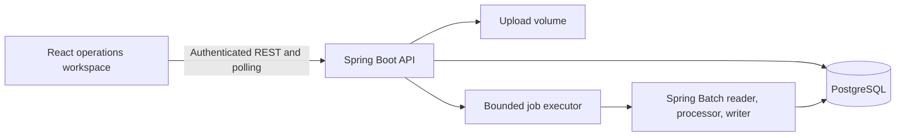

# BalanceTrail

## Project Architecture

Project author: **Yashwardhan Verma**

[GitHub](https://github.com/YashwardhanV) · [LinkedIn](https://www.linkedin.com/in/yashwardhanv) · [Email](mailto:yashwardhanverma108@gmail.com)

BalanceTrail is a transaction-reconciliation application built as a modular monolith with Java 21, Spring Boot, Spring Batch, PostgreSQL, React, TypeScript, and Tailwind CSS. It accepts a payment-gateway CSV, validates and compares each row with an internal ledger, and exposes durable run summaries and discrepancy evidence.



- **Frontend:** React and TypeScript provide sign-in, CSV upload, active-run polling, outcome summaries, run history, and paginated discrepancy review.
- **API and orchestration:** Spring MVC controllers expose multipart upload and owner-scoped query endpoints. A valid upload is hashed and stored, then a `PENDING` run and an after-commit launch event are created in one transaction. The API returns `202 Accepted` while a bounded executor starts the batch job.
- **Batch pipeline:** Spring Batch reads one CSV record at a time, maps and validates fields, checks restart-aware duplicates, compares valid transactions with the ledger, and writes chunk results. Outcomes are `MATCHED`, `AMOUNT_MISMATCH`, `MISSING_IN_LEDGER`, `INVALID`, or `DUPLICATE`.
- **Reliability:** Invalid and duplicate rows are skipped with durable evidence. Transient data-access failures receive bounded exponential retries; permanent failures mark the run `FAILED` while committed chunk results remain queryable.
- **Idempotency:** SHA-256 identifies identical file bytes within an owner scope. A database uniqueness constraint prevents two reconciliation runs for the same owner and hash, including concurrent uploads.
- **Persistence and security:** PostgreSQL stores users, ledger transactions, reconciliation runs, row outcomes, and Spring Batch metadata. Flyway manages constraints and query-driven indexes. BCrypt-backed HTTP Basic authentication and owner-scoped queries prevent one user from reading another user's runs.
- **Execution model:** The batch step is intentionally single-threaded to preserve deterministic first-occurrence duplicate semantics and straightforward restart behavior. The executor can run bounded jobs asynchronously without creating unbounded threads.

## How to Run

1. Install Docker Desktop or Docker Engine with Docker Compose.
2. From the repository root, optionally copy `.env.example` to `.env` and change the local credentials or batch settings.
3. Build and start PostgreSQL, the backend, and the frontend:

   ```bash
   docker compose up --build
   ```

4. Open the application:

   - Dashboard: <http://localhost:3000>
   - Backend API: <http://localhost:8080>
   - OpenAPI UI: <http://localhost:8080/swagger-ui.html>
   - Health: <http://localhost:8080/actuator/health>

5. Sign in with the local credentials:

   ```text
   username: analyst
   password: change-me-now
   ```

6. Upload `backend/src/main/resources/demo/gateway-transactions.csv` to exercise matched, mismatched, missing, duplicate, and invalid outcomes.
7. Stop the stack without deleting the database or upload volumes:

   ```bash
   docker compose down
   ```

For local development, start PostgreSQL with `docker compose up -d db`. Run `./mvnw spring-boot:run` from `backend` (`mvnw.cmd spring-boot:run` on Windows), then run `npm ci` and `npm run dev` from `frontend` in a second terminal. Use Java 21 and Node.js 24 for the same versions as the containerized workflow.

Run the verification suites with:

```bash
cd backend
./mvnw verify

cd ../frontend
npm ci
npm run build
```

Backend integration tests require Docker because Testcontainers starts a real PostgreSQL instance.

## Interview Prep

**Q: Why use Spring Batch for reconciliation instead of processing the entire file in a controller?**

**A:** Chunk processing provides explicit reader, processor, and writer stages; bounded transactions; restart metadata; retry and skip policies; and durable progress. The upload request can return promptly while the job processes asynchronously, and a failure does not require reprocessing every previously committed chunk.

**Q: How does BalanceTrail prevent duplicate processing of the same file?**

**A:** The service computes a SHA-256 hash of the uploaded bytes and scopes it to the authenticated owner. A unique database constraint on owner and hash is authoritative under concurrent uploads. A duplicate returns the original run instead of launching a second job.

**Q: How are bad rows handled without hiding data-quality problems?**

**A:** Mapping and validation classify malformed records as `INVALID`, while repeated valid transaction IDs become `DUPLICATE`. Spring Batch skips those rows within a configured safety limit, but a listener persists line-level evidence and the run summary records the skipped counts. This allows useful rows to complete without silently discarding failures.

**Q: Why is the batch step single-threaded?**

**A:** Duplicate classification depends on the first accepted occurrence in file order. A single-threaded step keeps that result deterministic and makes checkpoints and restarts easier to reason about. Parallelism should be introduced only after profiling, with partitioning and duplicate ownership rules designed explicitly.

**Q: How is asynchronous job launch coordinated with the upload transaction?**

**A:** The stored file, run record, and after-commit launch event are created as one transaction. The listener submits work only after commit, so a worker cannot observe a run that later rolls back. If the process crashes after commit but before submission, a stale-`PENDING` recovery mechanism is the next production hardening step.

**Q: What is the difference between retry, skip, and job failure here?**

**A:** Retry handles bounded transient data-access errors. Skip handles row-level validation or duplicate conditions while retaining evidence. A permanent reader, writer, or job error marks the run `FAILED`; previously committed chunks remain visible for diagnosis.

**Q: Why test with PostgreSQL Testcontainers instead of an in-memory database?**

**A:** The design depends on PostgreSQL constraints, indexes, transaction behavior, and Spring Batch metadata. Testcontainers runs the same database family used by the application, so integration tests validate migration and persistence behavior that an in-memory substitute may implement differently.
