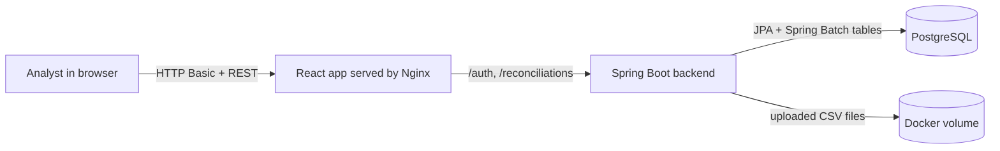
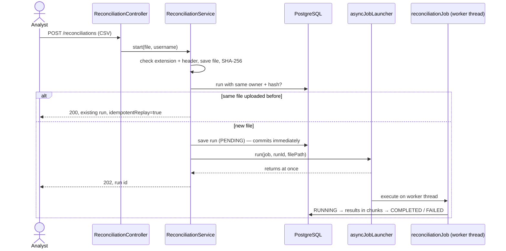
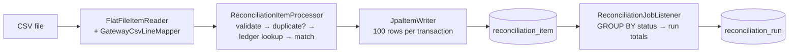
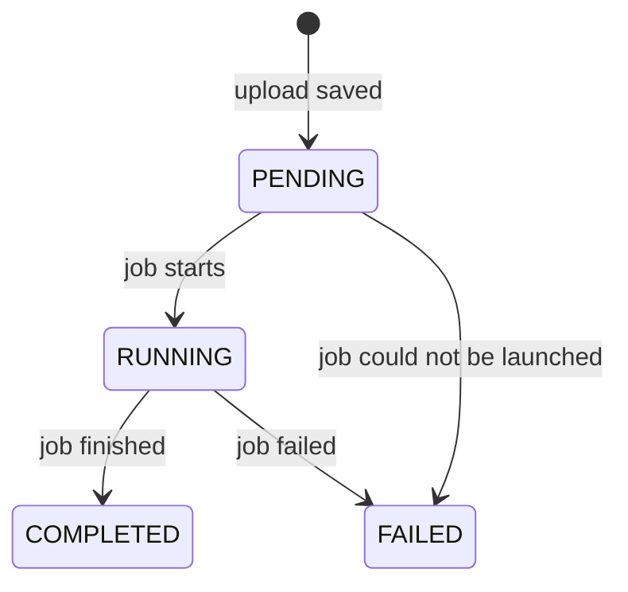

# Architecture

BalanceTrail is one Spring Boot application, one React application and one PostgreSQL database.

## Packages

| Package | What lives there |
|---|---|
| `controller` | REST endpoints, status codes, request parameters |
| `service` | Upload flow, file storage, run status updates, matching rule |
| `batch` | CSV line mapper, item processor, duplicate detector, job listener |
| `repository` | Spring Data JPA repositories |
| `entity` | JPA entities (database rows) |
| `dto` | API response records; entities are never returned directly |
| `domain` | Enums and small value records |
| `config` | Spring Batch, Security, OpenAPI, startup user |
| `security` | Loads users from the database for login |
| `exception` | Custom exceptions and the global error handler |

## Upload flow

`ReconciliationService.start()` is not `@Transactional`, so `runRepository.save()` commits before the job is launched. The worker thread therefore always finds the run row.

The launcher uses a thread pool with 2 threads. Two reconciliations can run at the same time; more uploads wait in the pool's queue.

## Batch job

One job, one step, chunk size 100.

- The **reader** reads one line at a time. `GatewayCsvLineMapper` splits it into 4 text columns. A broken line (wrong column count, unclosed quote) is kept with a `parseError` instead of crashing the job.
- The **processor** returns exactly one result per line. Invalid and duplicate lines are results too, not exceptions.
- The **writer** saves each chunk of 100 results in one database transaction.
- The **job listener** marks the run `RUNNING` before the job, and after it either stores the counts (`COMPLETED`) or the error message (`FAILED`).

If the database throws a temporary error while writing a chunk, the chunk is rolled back and tried again, up to 3 attempts in total with exponential back-off (100 ms, then 200 ms). A permanent error fails the job.

## Outcomes

| Condition | Status |
|---|---|
| Row is malformed or a field is invalid | `INVALID` |
| Transaction ID already appeared on an earlier line of this file | `DUPLICATE` |
| No ledger row with this transaction ID | `MISSING_IN_LEDGER` |
| Ledger row found, amount differs (`BigDecimal.compareTo`) | `AMOUNT_MISMATCH` |
| Ledger row found, amount equal | `MATCHED` |

## Duplicate detection

`DuplicateDetector` keeps a map of transaction ID → first line number seen, one map per job run. A later line with the same ID is a duplicate. The same line seen again is not, because a retried chunk processes its rows a second time.

## Same file uploaded twice

The file's SHA-256 hash is stored on the run, and `(owner_id, file_sha256)` is unique in the database. The service looks for an existing run first and returns it. If two identical uploads arrive at the exact same moment, the unique constraint rejects the second one and the API returns 409.

## Run statuses

## Security

Users are stored in PostgreSQL with BCrypt password hashes. Every request uses HTTP Basic authentication (no sessions). Every run query includes the logged-in username, so user A gets 404 for user B's run even with the right UUID. HTTP Basic is fine on localhost; a hosted version would need HTTPS.

## Errors

| Situation | Response |
|---|---|
| Not a `.csv`, empty, or wrong header | 400 |
| File over 25 MB | 413 |
| Not logged in | 401 |
| Run doesn't exist or isn't yours | 404 |
| Database constraint violated | 409 |
| Anything unexpected | 500, details only in the server log |

## Known limitations

- One ledger query per row; fetching a whole chunk at once would be faster.
- If the server stops while a job is running, that run stays `RUNNING`; there is no retry button yet.
- Uploaded files are kept on disk with no clean-up job.
- Only single-line, comma-separated UTF-8 CSV is supported.
