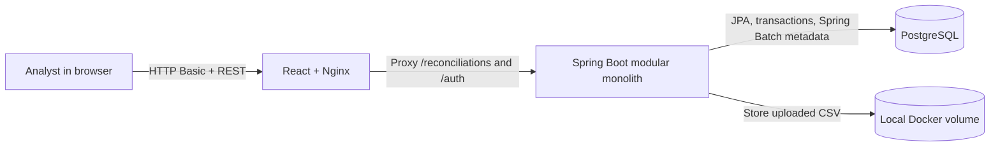
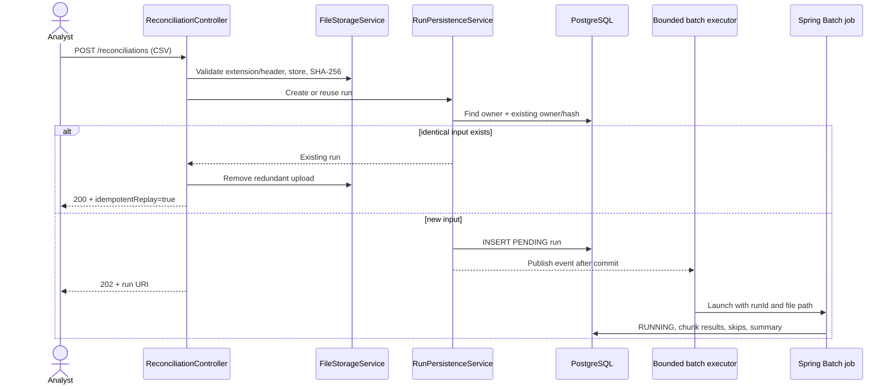
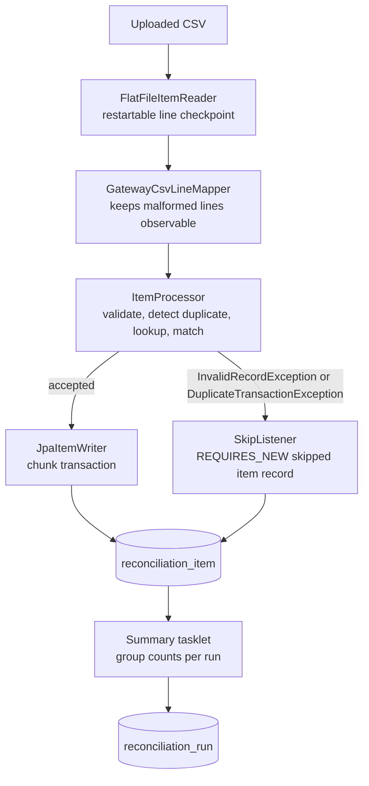
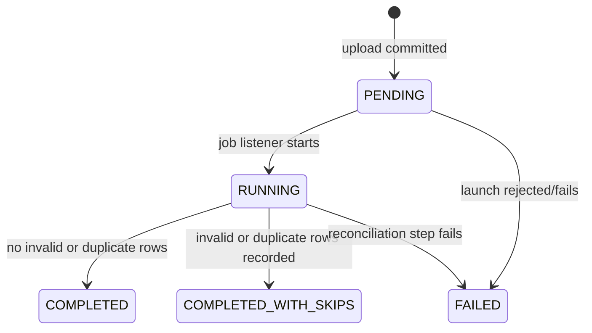

# BalanceTrail Architecture

## Goal

BalanceTrail reconciles a gateway CSV against an internal ledger without turning a portfolio project into a distributed system. It is a modular monolith: one React UI, one Spring Boot process, and one PostgreSQL database.

## System context

The backend is the only component allowed to read or write business data. Nginx serves static frontend assets and provides a same-origin reverse proxy; it is not an API gateway.

## Backend package responsibilities

| Package | Responsibility |
|---|---|
| `controller` | HTTP contracts, status codes, multipart boundary, pagination parameters |
| `service` | Use-case orchestration, file storage, run ownership, state transitions, matching |
| `repository` | Spring Data JPA queries scoped to a run or owner |
| `entity` | Persistence model and controlled run state changes |
| `domain` | Statuses and immutable domain values |
| `dto` | API responses; JPA entities never cross the controller boundary |
| `batch` | CSV mapping, reader/processor/writer, duplicate state, retry/skip, summary |
| `security` | Database-backed `UserDetailsService` |
| `exception` | Domain/API failures and RFC 9457-style problem responses |
| `config` | Security, OpenAPI, Spring Batch, bounded executor, environment properties |

## Upload and execution sequence

Publishing the launch event after the run transaction commits prevents a worker from starting before the `PENDING` row is visible. The executor is bounded (two threads and a finite queue by default), so an upload burst cannot create unlimited application threads.

## Batch pipeline

The reader maps CSV columns to strings first. Amounts and dates are deliberately parsed in the processor so bad field values follow the configured business skip path instead of failing as opaque reader-binding errors.

The chunk transaction writes accepted items. A skipped item is recorded in a short independent transaction because the chunk that encountered the exception can roll back. The unique `(run_id, line_number)` constraint makes that listener safe if a framework retry invokes it again.

## Matching rules

| Condition | Outcome |
|---|---|
| Ledger transaction ID exists and amount is numerically equal | `MATCHED` |
| Ledger transaction ID exists and amount differs | `AMOUNT_MISMATCH` |
| Ledger transaction ID does not exist | `MISSING_IN_LEDGER` |
| Required field, amount, date, column count, or CSV quoting is invalid | `INVALID` and skipped |
| A valid transaction ID appeared earlier in this run | `DUPLICATE` and skipped |

Account number and transaction date are validated and retained for investigation, but transaction ID is the ledger lookup key and amount is the reconciliation value. Comparing extra attributes can be added only with an explicit business rule and a corresponding status.

## Idempotency and constraints

There are three complementary controls:

1. The uploaded bytes are hashed with SHA-256. `(owner_id, file_sha256)` is unique, so the same analyst receives the original run for identical content.
2. A step-scoped set detects repeated valid transaction IDs within a file. On restart, it is preloaded from committed accepted rows.
3. A PostgreSQL partial unique index permits visible `INVALID`/`DUPLICATE` evidence but prevents two accepted outcomes for the same `(run_id, gateway_transaction_id)`.

The database constraints are authoritative. Application checks exist to return useful domain outcomes rather than raw constraint errors.

## Run state model

The summary step is attempted after every reconciliation-step exit so partial results remain inspectable. The job listener then preserves a failed main-step outcome rather than letting a successful summary hide it.

## Transactions and concurrency

- Run creation and event publication share one transaction; launch happens `AFTER_COMMIT`.
- Each configured chunk is one Spring Batch transaction.
- Skip evidence uses `REQUIRES_NEW` so the rejected row survives the surrounding rollback.
- Summary calculation and run update use a transaction.
- Run rows use optimistic `@Version` locking to detect conflicting lifecycle updates.
- The batch step itself remains single-threaded. Multiple independent runs can use at most the configured worker count.

No partitioning or multithreaded step is used. Single-threaded item order simplifies duplicate semantics and restart behavior; benchmark first, then add concurrency only if a real requirement is unmet.

## Security boundary

Users are stored in PostgreSQL with BCrypt password hashes and one `ANALYST` role. REST endpoints use stateless HTTP Basic authentication. Every run query includes the authenticated username, so knowing a UUID does not bypass ownership.

HTTP Basic is intentionally small and inspectable for a local portfolio app. It requires HTTPS outside localhost. A future hosted version could replace it with an external OIDC provider without changing the reconciliation model.

## Failure behavior

| Failure | Behavior |
|---|---|
| Bad extension, empty file, or wrong header | `400 Bad Request`; no run created |
| File exceeds configured request limit | `413 Payload Too Large` |
| Invalid/duplicate row | Skip, persist evidence, continue until configurable safety limit |
| Transient Spring data-access failure | Bounded exponential retry with configurable delays |
| Permanent writer/reader/job failure | Run marked `FAILED`; partial committed data remains queryable |
| Duplicate upload | `200 OK`, original run ID, no second job |
| Missing or another user's run | `404 Not Found` to avoid ownership disclosure |
| Full executor queue | Committed run marked `FAILED` with launch reason |

## Performance choices

- Configurable chunk size defaults to 100.
- Sequence allocation and Hibernate JDBC batching allow grouped inserts.
- Indexes support owner history, run status, ledger lookups, and discrepancy pagination.
- The Hikari pool defaults to eight connections rather than an unexplained large pool.
- Accepted transaction IDs are held in one in-memory set per active run. This is reasonable for the included 100,000-row benchmark but is a documented memory tradeoff.
- Ledger lookup is one indexed primary-key query per valid unique row. A bulk-prefetch strategy could reduce round trips but would complicate the standard item-processor model and must be benchmark-justified.

## Explicit non-goals

No microservices, Kafka, Redis, API gateway, Kubernetes, distributed worker, CQRS, event sourcing, multiple databases, tracing stack, or metrics platform is included. These technologies do not improve the core learning objective at the current scope.
