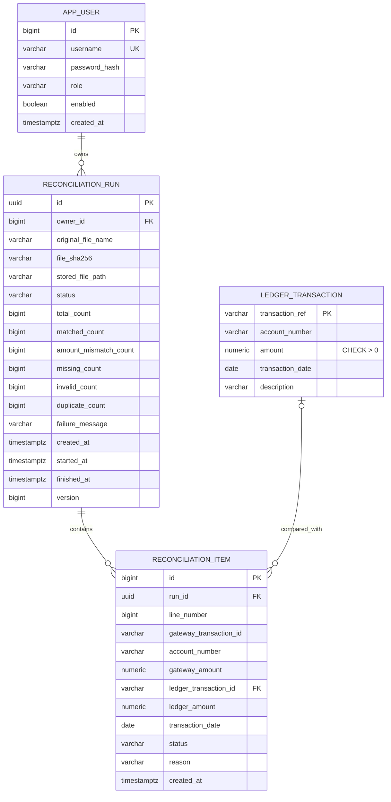

# Database / ER Diagram

## Constraints and indexes

| Object | Purpose |
|---|---|
| `uk_app_user_username` | Prevents duplicate login identities |
| `ck_ledger_amount_positive` | Keeps invalid ledger money values out of the source of truth |
| `uk_run_owner_hash (owner_id, file_sha256)` | Makes an identical upload idempotent per analyst |
| `uk_item_run_line (run_id, line_number)` | Ensures one observable outcome per physical input line |
| `uk_item_run_accepted_gateway` partial unique index | Prevents two accepted results for one gateway ID while allowing duplicate/invalid evidence rows |
| `idx_run_owner_created` | Supports newest-first run history |
| `idx_run_status_created` | Supports lifecycle/operations queries |
| `idx_item_run_status_line` | Supports paginated discrepancies in CSV order |
| `idx_ledger_account_date` | Supports plausible future ledger investigation by account and date |

Spring Batch's `BATCH_*` metadata tables are also stored in PostgreSQL. They belong to the framework's job repository and are intentionally omitted from the business ER diagram.
