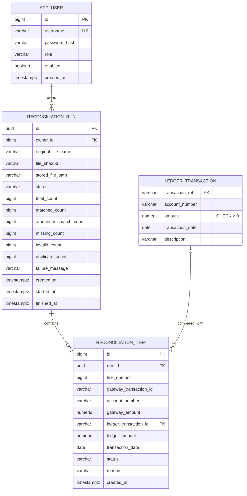

# Database / ER Diagram

## Constraints and indexes

| Object | Why it exists |
|---|---|
| `uk_app_user_username` | No two users with the same login |
| `ck_ledger_amount_positive` | Ledger amounts must be greater than zero |
| `uk_run_owner_hash (owner_id, file_sha256)` | The same user can't create two runs for the same file |
| `uk_item_run_line (run_id, line_number)` | One result per CSV line |
| `ck_run_status`, `ck_item_status` | Only known status values can be stored |
| `idx_run_owner_created` | Run history: my runs, newest first |
| `idx_item_run_status_line` | Discrepancy page: this run's non-matched rows in line order |

Ledger lookups use the `transaction_ref` primary key, so they need no extra index.

`reconciliation_item` ids come from a sequence that hands out 100 values at a time (`allocationSize = 100`). With an identity column Hibernate would have to insert rows one by one to learn each id; with a sequence it can send the 100 inserts of a chunk as one JDBC batch.

Spring Batch also creates its own `BATCH_*` tables in the same database to record job and step executions. They are left out of the diagram above.
